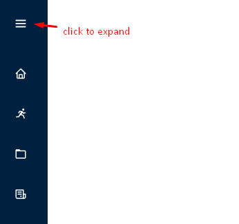

# PostgreScrutiniser

PostgreSQL configuration management tool, inspired by [MySQLTuner](https://github.com/major/MySQLTuner-perl).

This is the code repository for my final software development bachelor project.

## Installation

The frontend and backend sides can be installed separately. The application has been created and fully tested on AlmaLinux 8.7. This project assumes that passwords inside `/etc/shadow` are hashed with the **SHA512** algorithm. 

### Backend Setup

To setup the backend part of this project, change directory to `backend/` and run `setup.sh`:
```
cd backend/
./setup.sh
```

This will create all the necessary execution related files as well as a systemd service file, allowing you to control it using `systemctl`. Make sure that correct PostgreSQL user and password names are provided as that's what what will be used by our application to communicate with PostgreSQL.

The setup script will also output login details for our main user. If you end up losing it, simply change the password with `passwd postgrescrutiniser` and use the new password.

After setup is complete, feel free to remove this repository.

### Frontend Setup

To setup the frontend part of this project, build it for production with:
```
cd frontend/
npm install
npm run build
```

Depending on where the frontend part of this project is being setup, the way it should be served will differ. Easiest option is to install `http-server` package and then running it inside `frontend/dist/` directory:
```
npm install -g http-server
http-server
```

After that enter the `http` address that's given below `Available on:` part of the output.

Note that only the files inside `dist/` directory would then be of any importance. The rest can be removed.

## Usage Guide

The login window contains three input fields:
- "Hostname or IP address" - the server to which you want to connect. This can be the IP address or hostname of the system where the PostgreScrutiniser server interface is registered.
- "Username" – This is the username that was created during installation. By default it should be "postgrescrutiniser".
- "Password" - password that is created during installation. The password should have been provided when the server interface was installed, along with the login name. If you forget or lose your password, it can be changed as root with the passwd command.


When logged in, the navigation window is collapsed. Hovering the mouse over each of the icons shows the name of the page the button leads to.



### Configuration Management

To manage the PostgreSQL configuration, click **Runtime Configurations** in the navigation window


Recommendation are returned by clicking **Get Checks**. In order to view any of the recommendations, click on the "Suggestions ..." expandable window and then the parameter of interest.


The above image shows a list of all parameters. The **Suggestions** table shows only parameters for which recommendations are made. The name of each of the parameters is given in collapsible windows along with the recommended value inside parentheses. 

In the expanded recommended parameter window, the current (**Current value**) and recommended (**Suggested value**) values are presented. Below that is a short description of the parameter and an explanation of what the recommendation was based on. The parameter can be applied by pressing **Apply Suggestion** or by ticking the input box. Clicking **Apply %{n} suggestions** at the top will allow you to adjust one or more parameters.


Clicking any of the **Apply ...** buttons applies one or more configuration parameters (depending on the applied button pressed) and re-displays a new list of recommendations. Below is a case where all parameters are applied with the Apply All Suggestions button.


In order to not overload the system, the buttons related to configuration management are unclickable for 3 seconds after the last configuration application. This can be seen in the image above (the buttons are also grayed out and will give a warning message if clicked).

The user can choose to cancel all automatic configurations at any time by pressing the Reset Configurations button. To ensure that this is pressed intentionally, a confirmation window is displayed with an explanation of the action.


### Backup Copy Management

Making any configuration changes creates a copy of the current automatic configuration. To manage them, you need to be on the backup management page. This is available by clicking "Configuration Backups" in the navigation window (see the start of this guide for reference image).

A list of backups is returned by clicking List Backups. To view the difference between the current configuration and a backup copy, click that copy's window.


After the difference display, there are buttons for restoring (**Restore Backup**) and deleting the copy (**Delete Backup**). Each will present a confirmation window that further explains the consequences of said action.

In order to delete all copies, press the **Delete Backups** button.